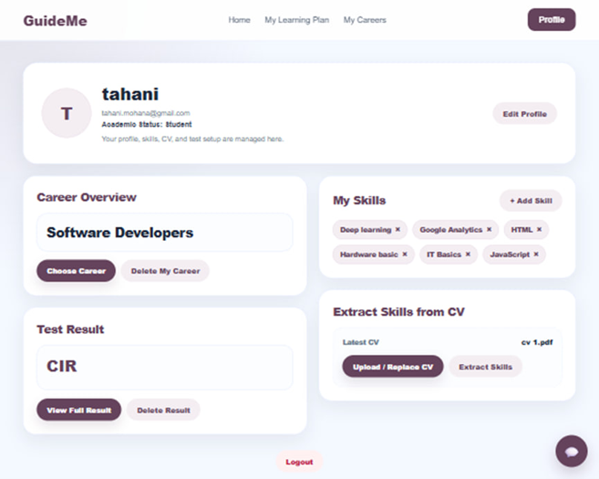
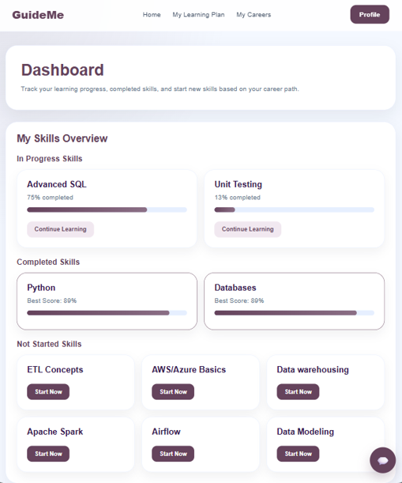
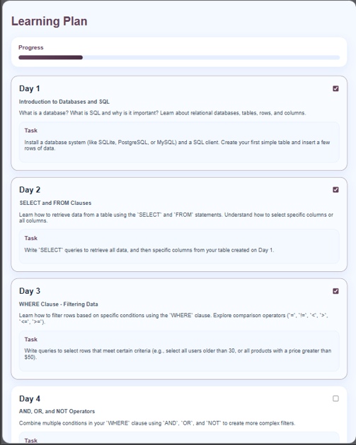
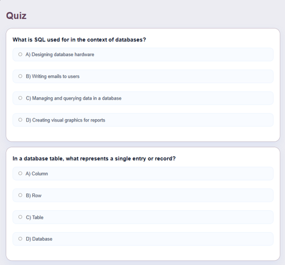

# GuideMe – AI-Powered Career Guidance Platform

GuideMe is an AI-powered career guidance platform designed to help Information Technology (IT) students and fresh graduates discover suitable career paths, identify skill gaps, and receive personalized learning recommendations.

The platform combines personality analysis, skills assessment, AI-powered recommendations, and automated learning plans to support users throughout their career development journey.

---

## Features

-  IT-focused personality assessment based on the Holland (RIASEC) model
-  AI-powered career path recommendations
-  Skills gap analysis
-  Personalized learning plan generation
-  AI Career Assistant (Chatbot)
-  Automatic quiz generation for learning assessment
-  Learning reminders and notifications
-  Progress tracking dashboard
-  User profile management

---

## Technologies Used

### Frontend
- HTML5
- CSS3
- JavaScript

### Backend
- PHP
- MySQL

### Automation & AI
- n8n
- OpenAI API
- Tavily Search

### Development Tools
- Visual Studio Code
- XAMPP
- phpMyAdmin
- Git
- GitHub

---

## System Architecture

The system consists of four main components:

- PHP Web Application
- MySQL Database
- n8n Automation Workflows
- AI Services

These components work together to deliver personalized career guidance and learning experiences.

---


## Main Modules

### Personality Assessment

Users complete an IT-focused Holland (RIASEC) assessment to determine their personality profile.

---

### Career Recommendation

The platform recommends suitable IT career paths by combining:

- Personality compatibility
- Skills matching
- AI analysis

---

### Learning Plan Generator

Based on the selected career path and current skills, GuideMe automatically generates a personalized learning .

---

### AI Career Assistant

An AI chatbot answers career-related questions, provides guidance, and supports users throughout their learning journey.

---

### Quiz Generator

Interactive quizzes are automatically generated to evaluate users' understanding after completing learning topics.

---

### Notifications

The system reminds users about learning progress, upcoming tasks, and quizzes.

---

## Installation

### Requirements

- PHP 8+
- MySQL / MariaDB
- XAMPP
- n8n
- Git

---

### Setup

1. Clone the repository

```bash
git clone https://github.com/Wissam029/GuideMe.git
```

2. Move the project into your web server directory.

3. Import the database

```
database/GuideMe_database.sql
```

using phpMyAdmin.

4. Update your database connection settings.

5. Import the n8n workflows located in:

```
n8n/
```

6. Configure your API keys inside n8n.

7. Start:

- Apache
- MySQL
- n8n

8. Open:

```
http://localhost/GuideMe
```

---


## AI Workflow

GuideMe utilizes n8n to automate:

- Career recommendation process
- Learning plan generation
- Quiz generation
- AI chatbot responses
- Notifications

Workflow files are included in:

```
n8n/
```

---

## Database

The project database contains tables for:

- User Accounts
- Personality Results
- Career Recommendations
- Learning Plans
- Plan Topics
- Quizzes
- User Progress
- Notifications

---

## Future Enhancements

- Support additional academic disciplines
- Mobile application
- Advanced analytics dashboard
- Gamification
- AI resume analysis
- Job opportunity integration
- Learning platform integration

---
##  Screenshots


###  Home Page
The landing page introduces GuideMe and provides users with quick access to the platform's main features, including career discovery and learning services.


---

###  User Profile
Displays the user's personal information, skills, career recommendations, and overall progress within the platform.



---

###  Personality Test
Users complete the IT-focused Holland (RIASEC) assessment to identify their interests and personality type.


---

###  Personality Test Result
Presents the user's Holland code, personality scores, and a summary of the assessment results used for career matching.


---

###  Career Path Selection
Allows users to choose whether they want AI-powered career recommendations or manual career selection.


---

###  Manual Career Selection
Users can manually select a preferred career path and receive a personalized learning plan.


---

###  AI Career Recommendations
Displays the top career paths generated by the AI based on personality analysis and skills matching.


---

###  Detailed Career Analysis
Provides an in-depth analysis of the selected career, including required skills, strengths, gaps, and learning recommendations.


---

###  Dashboard
Shows the user's learning progress, completed skills, ongoing plans, and overall performance in one place.



---

###  Personalized Learning Plan
Displays the AI-generated learning roadmap with daily tasks and structured study activities.



---

###  AI Quiz
Automatically generated quizzes help evaluate the user's understanding after completing each learning topic.


## Authors

- Wesam Albladi
- Tahani Almazmoumi
- Jana Alrbighi
- Atheer Alyazidi

Supervisor:

**Dr. Entisar Alkayal**

---

## License

This project was developed as a Graduation Project for academic purposes.


